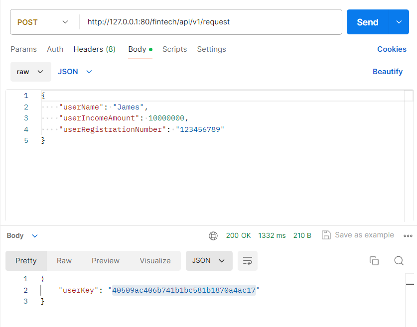
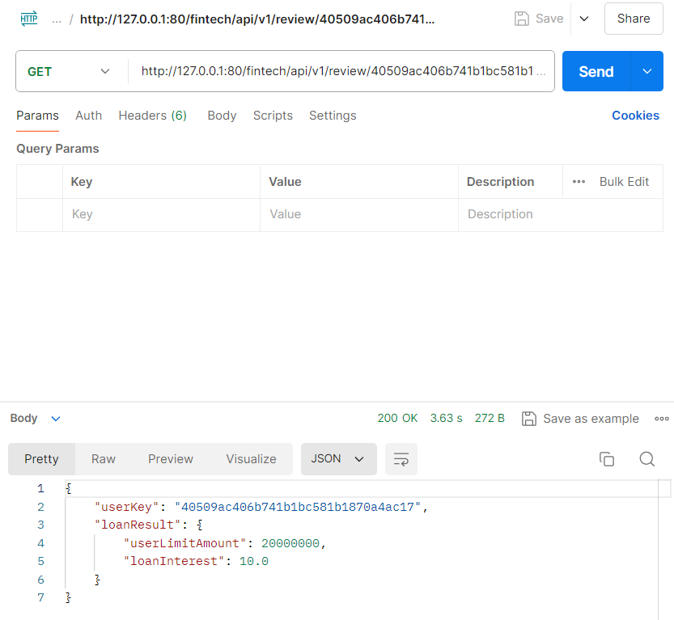

# Fintech API
## 대출 심사 API

- ## 요구사항 ( REST API 구현 )
1. 사용자의 정보를 입력받아 사용자의 정보를 DB에 저장
2. 사용자의 정보를 바탕으로 CSS 서버에 요청하여 대출심사 결과정보를 DB에 저장
3. 사용자의 키를 입력받아 해당하는 사용자에 대한 대출심사 결과정보를 반환

* ## 프로젝트 구성도    

- ## 기술 요구사항
1. **멀티 모듈** 프로젝트를 통해 한 곳에서 다양한 모듈을 관리할 수 있도록 **마이크로서비스 아키텍처** 구현
2. **Kotlin**을 사용하여 프로젝트 가독성 및 안정성 향상
3. **JPA Spring Data**를 사용해 Repository 구현
4. 사용자의 주민번호를 **대칭키 암호화**를 이용하여 저장
5. 운영 환경과 테스트 환경의 DB를 **MYSQL**서버와 **H2 Embeded**서버로 분리
6. **schema.sql**과 **data.sql**을 활용한 테이블 및 기본 데이터 생성
7. **Redis** 캐시 서버를 통해 한번 요청된 대출 심사 결과 정보를 IO 작업없이 바로 반환
8. **Kafka**를 활용하여 입력받은 사용자의 정보를 DB에 저장 및 메시지큐에 Send하는 API 모듈(producer)과
   메시지큐로부터 읽어와 **RestTemplate**을 사용하여 대출 심사를 요청하는 consumer 모듈로 분리하는 비동기식 처리 구현
9. **Spring AOP** 기능을 활용해 **로깅 AOP** 구현, **custom error** 및 **error handler**를 통한 일관성 있는 예외 처리
10. **swagger ui**를 통한 반응형 API 문서 제작
11. **nginx**를 통해 CSS 모듈에 접근하기 위한 **프록시 서버** 구현
12. **docker** 및 **dockerfile, docker-compose**를 활용하여 도커 이미지 생성 및 실행을 간소화
13. 리눅스 **쉘 스크립트**를 활용하여 빌드 및 도커 이미지 생성 자동화

* ## Spring Boot 개발환경
  * Intellij IDE
  * 내장 tomcat
  * embeded h2 Database
  * MYSQL Database
  * Redis server
  * Swagger
  * Kafka
  * Nginx proxy server
  * Docker
  * postman

* ## DB 테이블    

* ## Postman 사용 예
  * **대출 심사 요청**    
      
  * **심사 결과 조회**    
      

